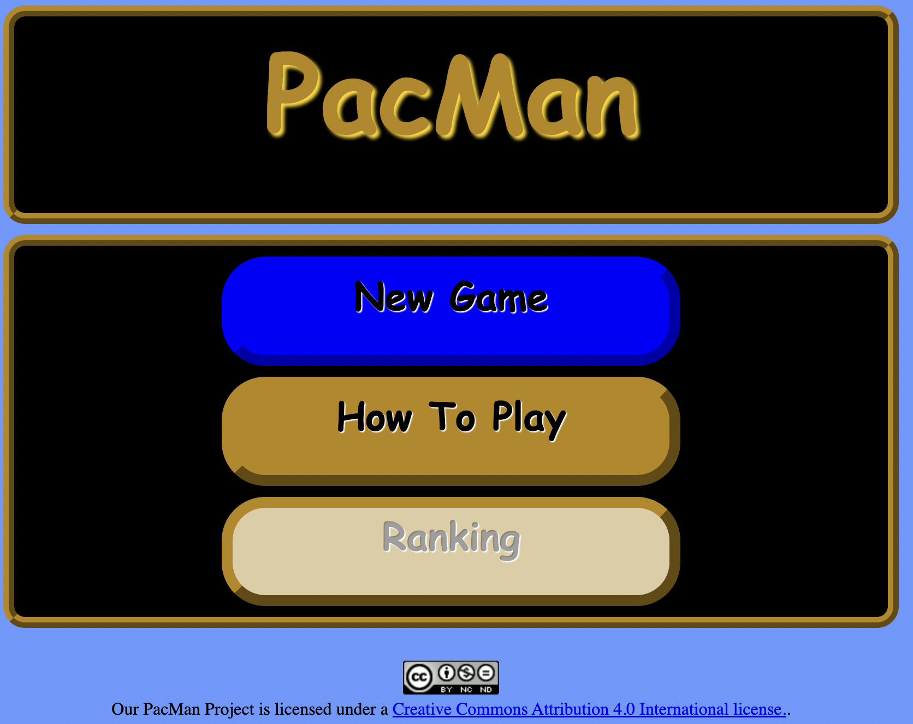
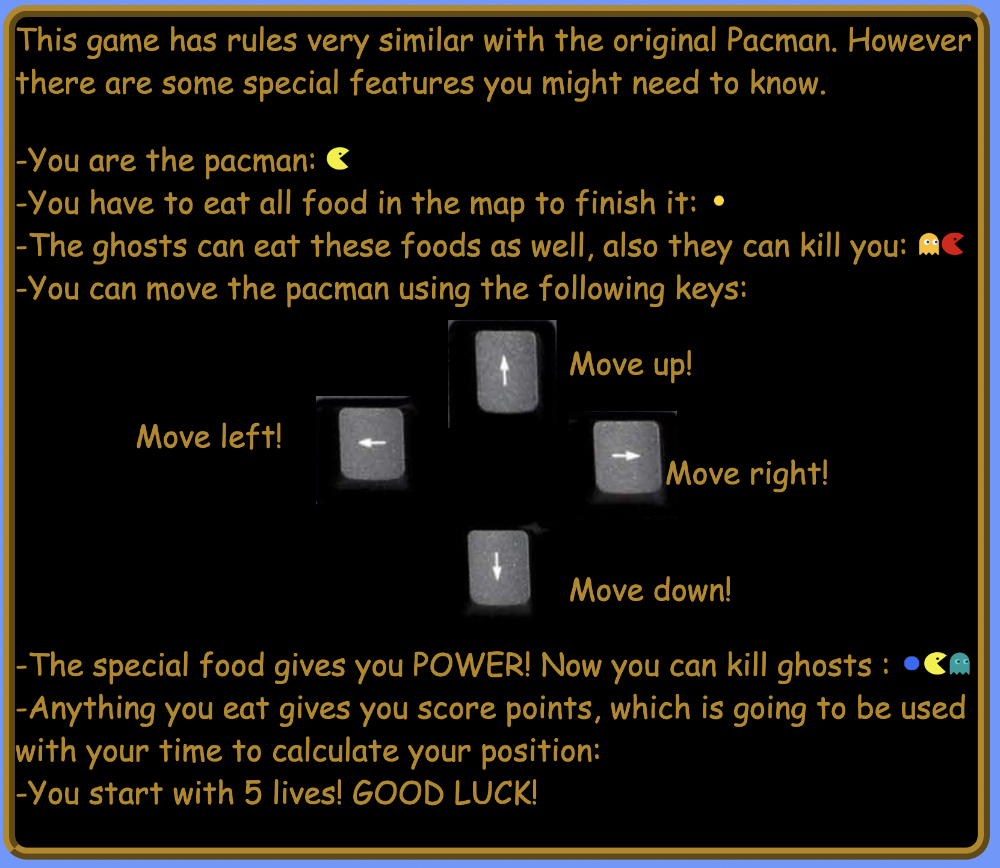
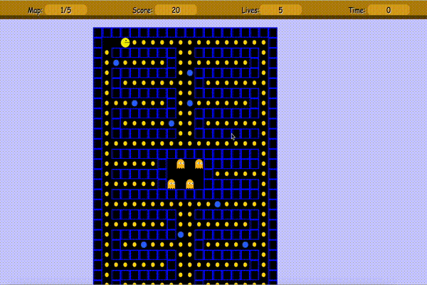

# PacMan Web Game

This was a project for the JavaScript Class Fall 2014 Douglas College.

It was mandantory to build a Web Application only using basic web applications technologies as HTML, CSS and JavaScript.

## How to Run

Install docker and execute

```
make run PATH=$(pwd)
```

## Game Screemshots

### Menu


### How To Play


### Game Play


## Developers

[jardel-lima](https://github.com/jardel-lima)
[faelpkp](https://github.com/faelpkp)
[pablokintopp](https://github.com/pablokintopp)